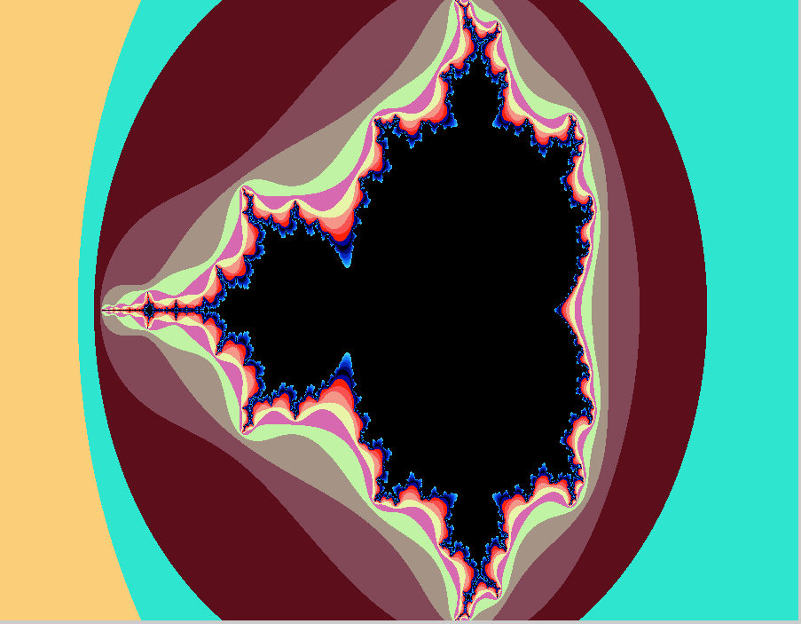
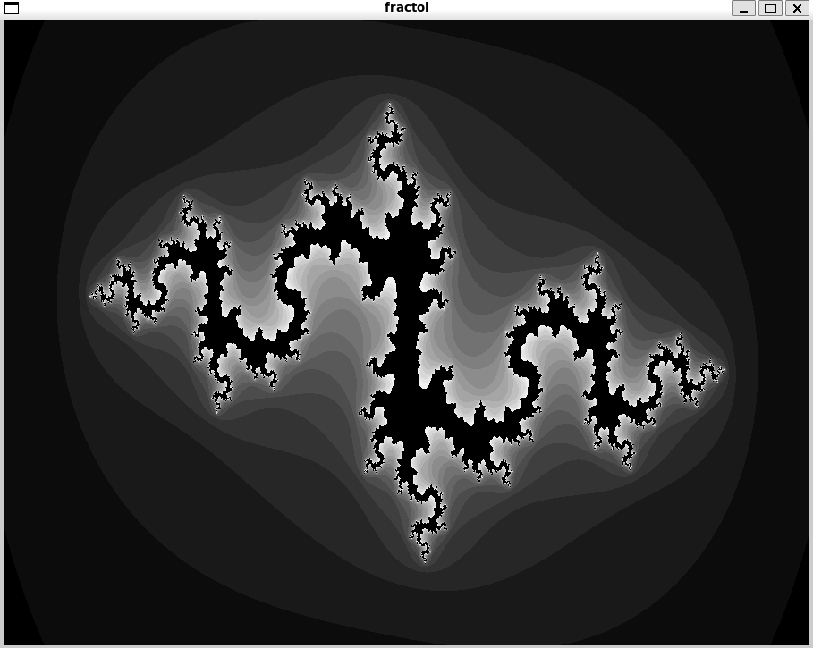
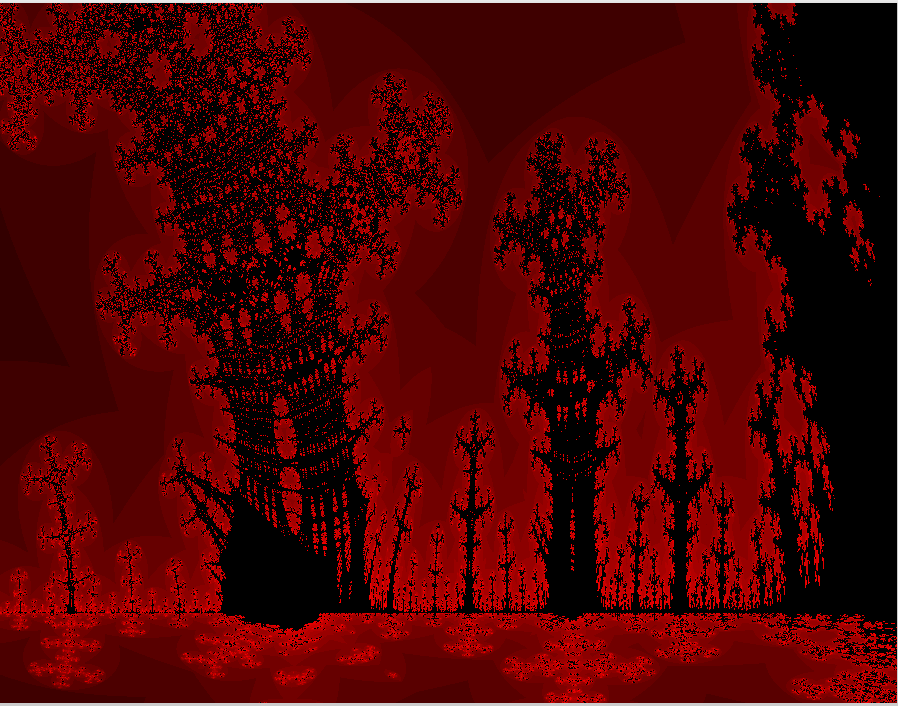

# Fractol

Fractol is a fractal visualization project developed in C, using the [MinilibX](libs/minilibx-linux/) graphics library. This project was created as part of the 42 school curriculum to explore 2D graphics programming, mathematical visualization, and interactive application development.

## Features

- **Fractal Rendering:** Supports multiple fractal types, including Mandelbrot, Julia, and Burning Ship sets.
- **Interactive Controls:** Zoom, pan, and modify fractal parameters in real time using keyboard and mouse.
- **Custom Color Schemes:** Dynamic coloring based on iteration counts for visually appealing fractal images.
- **Modular Codebase:** Clean separation between fractal logic, rendering, and user input handling.
- **Cross-Platform:** Runs on Linux and macOS (with X11/XQuartz).

## Why This Project?

- **Mathematical Visualization:** Demonstrates complex mathematical concepts through real-time graphics.
- **Low-Level Graphics:** Provides hands-on experience with pixel manipulation and window management using MinilibX.
- **Performance Optimization:** Efficiently computes and renders fractals, handling large iteration counts and high resolutions.
- **User Interaction:** Implements responsive controls for an engaging user experience.

## Project Structure

```
fractol/
├── Makefile
├── include/
│   ├── fractol.h
│   └── keycodes.h
├── libs/
│   ├── libft/           # Custom C library functions
│   └── minilibx-linux/  # MinilibX graphics library
├── objs/                # Compiled object files
├── srcs/
│   ├── atod.c
│   ├── burningship.c
│   ├── color.c
│   ├── fractol.c
│   ├── hook.c
│   ├── init.c
│   ├── julia.c
│   ├── mandelbrot.c
│   ├── move.c
│   └── utils.c
└── README.md
```

## How It Works

- **Fractal Calculation:** Each fractal type is implemented in its own source file (e.g., `burningship.c`), using mathematical formulas to determine pixel colors based on iteration escape times.
- **Rendering:** Pixels are drawn directly to an image buffer using a custom function, then displayed in a window with MinilibX.
- **User Input:** Keyboard and mouse events are handled to allow zooming, panning, and switching fractal types in real time.

## How to Build

1. **Install Dependencies:**
   - Linux:  
     ```sh
     sudo apt-get install gcc make xorg libxext-dev libbsd-dev
     ```
   - macOS:  
     Install [XQuartz](https://www.xquartz.org/)   

2. **Clone and Build:**
   ```sh
   git clone git@github.com:mapleinred/fractol.git
   cd fractol
   make
   ```

3. **Run:**
   ```sh
   ./fractol mandelbrot
   ./fractol julia
   ./fractol burningship
   ```

## What I Learned

- Deepened understanding of fractal mathematics and iterative algorithms.
- Gained experience with low-level graphics programming and event-driven design.
- Improved code modularity and maintainability in C.
- Enhanced debugging and optimization skills for graphical applications.

## Screenshots






## License

This project uses the BSD 2-Clause License. See [libs/minilibx-linux/LICENSE](libs/minilibx-linux/LICENSE) for details.

---

*Created as part of the 42 School curriculum by xzhang.*
